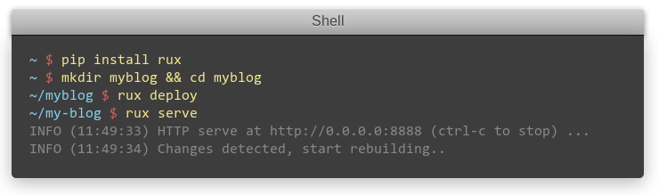

Rux
===

Micro and fast static blog generator designed **only for writing**.

latest version: v0.5.3

**Note**: rux may not be stable before v1.0 release.



Demo Site
----------

- Site: http://rux.hit9.org
- Code: https://github.com/hit9/rux/tree/gh-pages

Documentation
-------------

http://rux.readthedocs.org/

Installation
-------------

Install the latest code:

    pip install git+git://github.com/hit9/rux.git

Install from pypi:

    pip install rux

Common Issues
--------------

1. Installation troubles on Ubuntu: `cann't find Python.h`, solution:

  ```
  sudo apt-get install python-dev
  ```

License
-------

BSD. `Rux` can be used, modified for any purpose.
